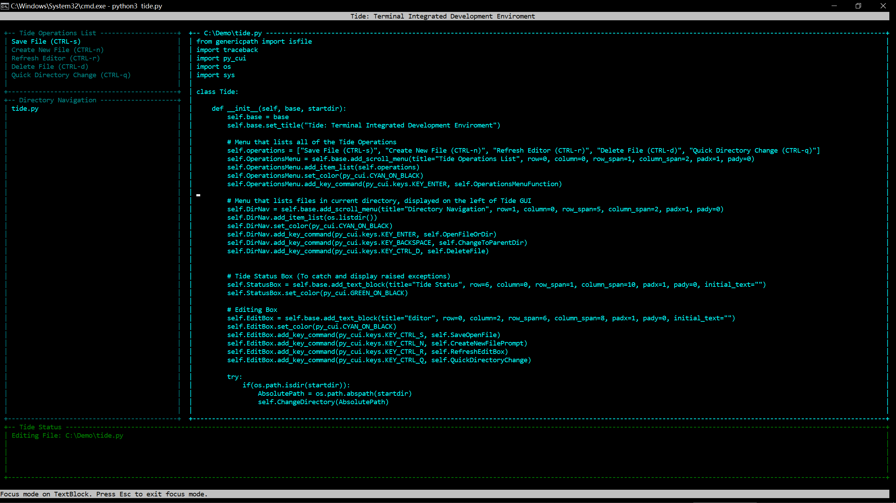

# Tide: Terminal Integrated Development Environment

**Tide** is a lightweight terminal-based text editor that has rudimentary IDE functions. It allows for the user to quickly navigate between directories and also create, modify and delete files. The text editor is programmed in Python and uses the **[py_cui](https://github.com/jwlodek/py_cui)** library to create its TUI (terminal user interface).

## Features

1. An integrated file explorer (named "Directory Navigation")
2. A color-coded status bar (named "Tide Status"). This status bar displays all things happening within Tide - what files Tide is editing, whether or not Tide has encountered any runtime issues, and such. The status bar flashes red if Tide has any problems during runtime (an example of a problem would be trying to open a file that isn't editable, or trying to navigate into a directory without proper permission), whilst at all other times the status bar stays green and displays messages updating what Tide is doing. 
3. Keyboard shortcuts for quick, simple operations such as saving the file currently being edited, creating a new file, refreshing the editor, deleting a file, or quickly changing into a directory of specified path. The possible operations of Tide and their corresponding shortcuts are listed in the "Tide Operations" box at the top left corner of Tide's UI. 

## Installation

No need! Just make sure you have the **py_cui** library installed within your local Python 3 environment (this can be done by running the command `pip install py_cui` or  `pip3 install py_cui`), then clone the project and run the file "tide.py" with `python3 tide.py`

## Usage

Tide can be used simply by running `python3 tide.py` in the directory containing the "tide.py" file. Or, you can specify which directory to start Tide in by running `python3 tide.py [directory]` . For example, you could start Tide in the directory `/usr/bin` by running `python3 tide.py /usr/bin` (assuming this is a Linux machine). 

Written on 2021/10/13
